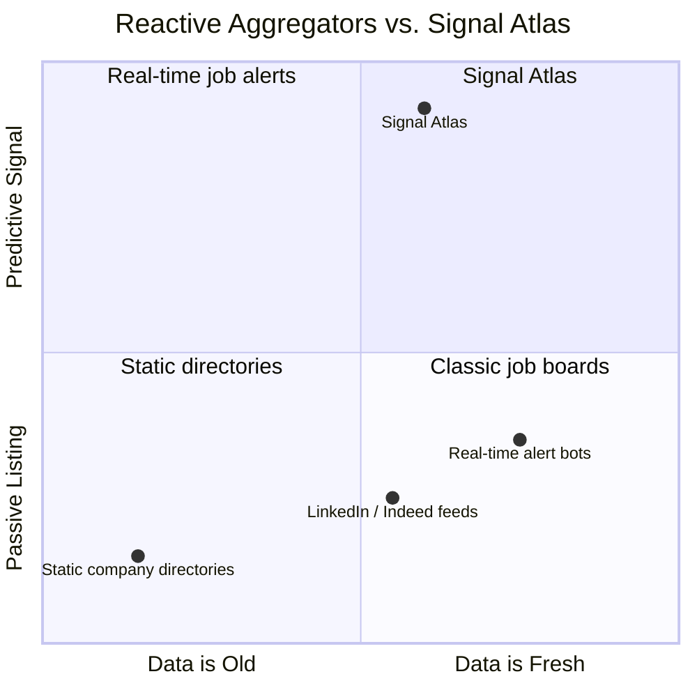
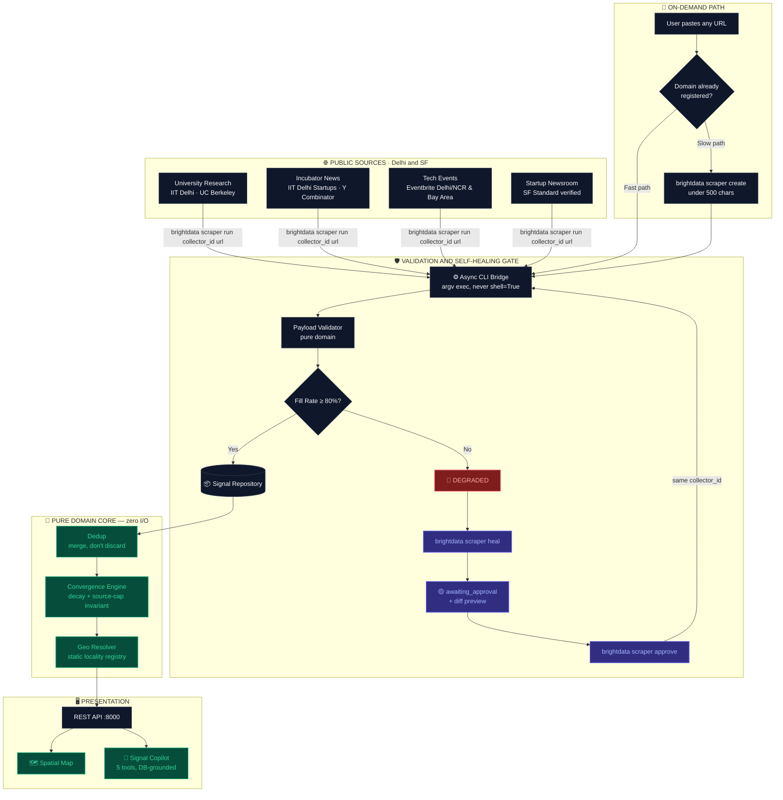
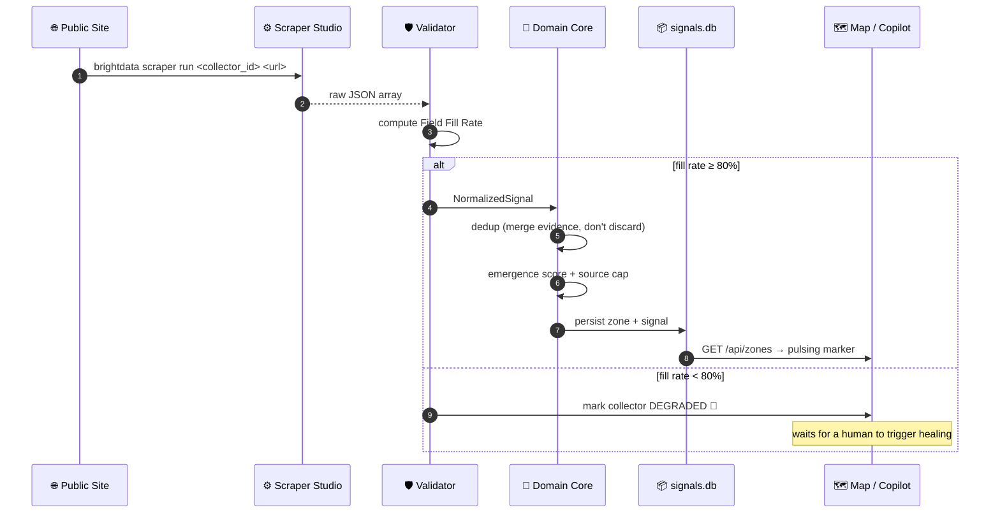
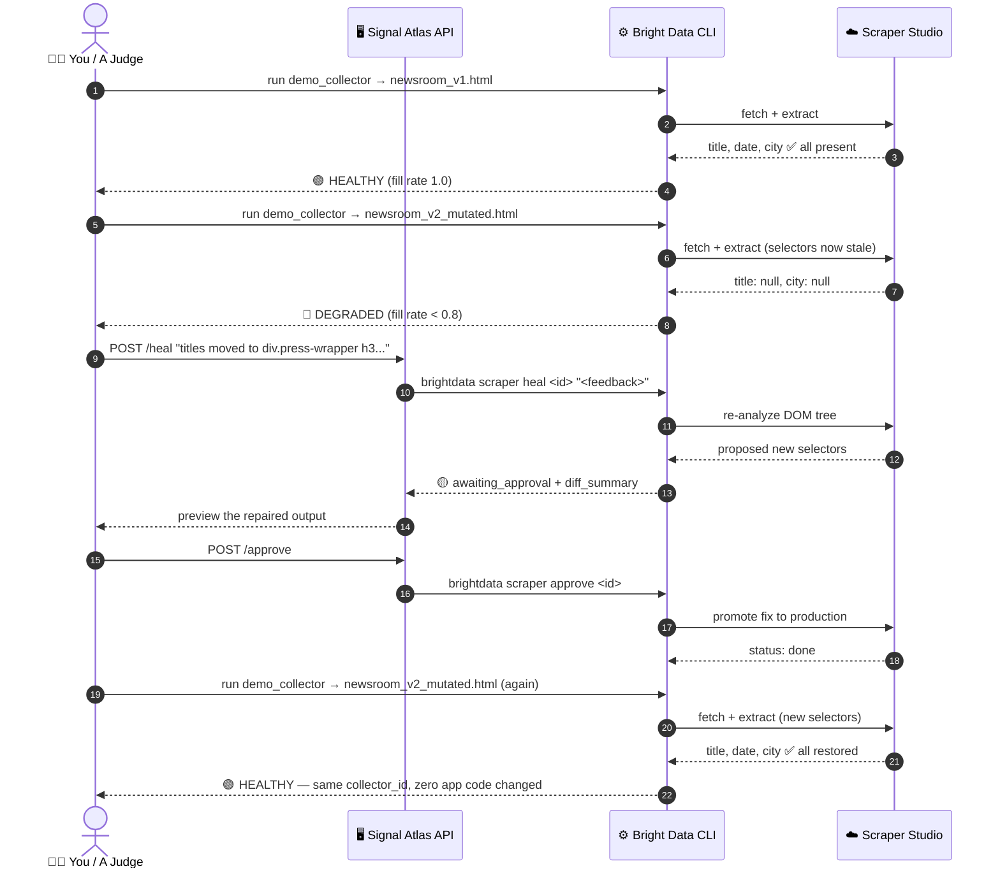
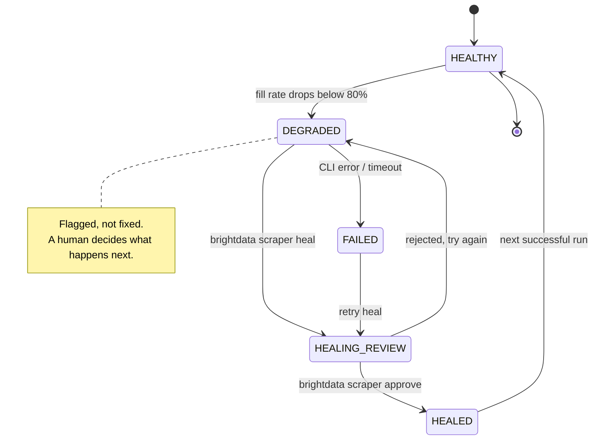
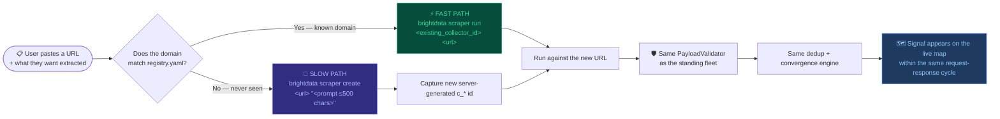
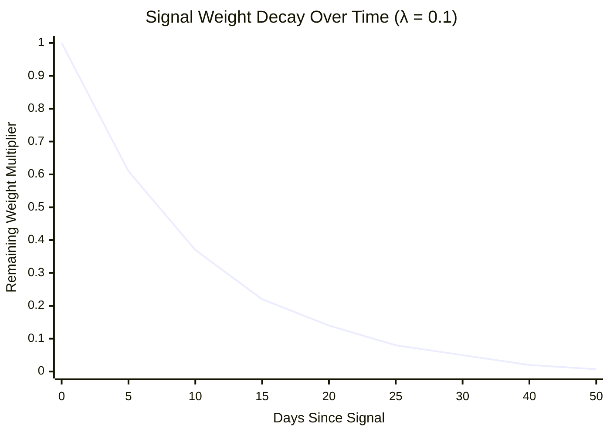
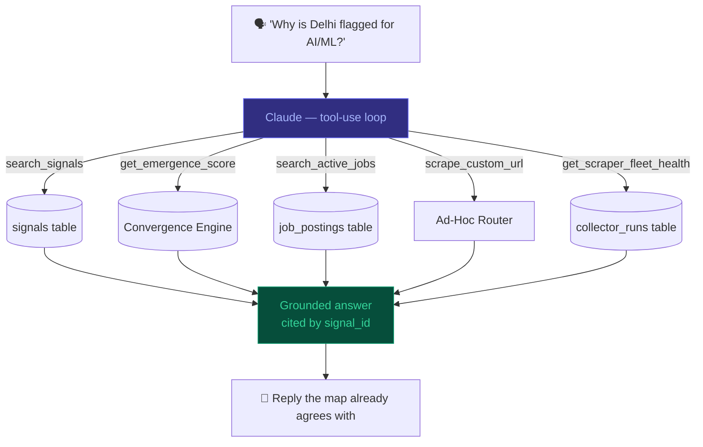
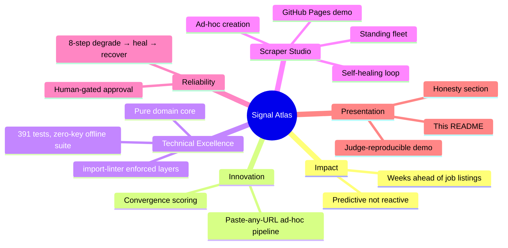

<div align="center">

```
                        ┌──────────────────────────────────────────────────────┐
                        │                                                      │
                        │    ███████╗██╗ ██████╗ ███╗   ██╗ █████╗ ██╗         │
                        │    ██╔════╝██║██╔════╝ ████╗  ██║██╔══██╗██║         │
                        │    ███████╗██║██║  ███╗██╔██╗ ██║███████║██║         │
                        │    ╚════██║██║██║   ██║██║╚██╗██║██╔══██║██║         │
                        │    ███████║██║╚██████╔╝██║ ╚████║██║  ██║███████╗    │
                        │    ╚══════╝╚═╝ ╚═════╝ ╚═╝  ╚═══╝╚═╝  ╚═╝╚══════╝    │
                        │                                                      │
                        │     █████╗ ████████╗██╗      █████╗ ███████╗         │
                        │    ██╔══██╗╚══██╔══╝██║     ██╔══██╗██╔════╝         │
                        │    ███████║   ██║   ██║     ███████║███████╗         │
                        │    ██╔══██║   ██║   ██║     ██╔══██║╚════██║         │
                        │    ██║  ██║   ██║   ███████╗██║  ██║███████║         │
                        │    ╚═╝  ╚═╝   ╚═╝   ╚══════╝╚═╝  ╚═╝╚══════╝         │
                        │                                                      │
                        └──────────────────────────────────────────────────────┘
```

### We don't scrape opportunities. We scrape the signals that reveal where opportunities are about to emerge.

*A self-healing, predictive signal-convergence engine built on Bright Data Scraper Studio.*
*Built for **Into the Scrape-Verse** — WeMakeDevs × Bright Data*

[]()
[]()
[]()
[]()
[]()
[]()

</div>

<br>

<div align="center">

| 🧠 Domain Core | 🔁 Self-Healing | 🧪 Test Suite | 🏙️ Coverage | 🤖 Copilot Tools | 🔓 Zero-Key Testing |
|:---:|:---:|:---:|:---:|:---:|:---:|
| Zero I/O, pure functions | `create → run → heal → approve` | **391 passing** | Delhi + SF | **5** DB-grounded tools | Full suite runs offline |

</div>

---

## Table of Contents

1. [Why This Exists](#-why-this-exists)
2. [What It Actually Does (and Doesn't)](#-what-it-actually-does-and-doesnt)
3. [System Architecture](#️-system-architecture)
4. [The Journey of a Single Signal](#-the-journey-of-a-single-signal)
5. [The Four Ways This Uses Bright Data Scraper Studio](#-the-four-ways-this-uses-bright-data-scraper-studio)
6. [Self-Healing: The Full Sequence](#-self-healing-the-full-sequence)
7. [Collector Lifecycle](#-collector-lifecycle)
8. [The Ad-Hoc Router](#-the-ad-hoc-router-paste-any-url)
9. [The Math](#-the-math)
10. [Signal Copilot](#-signal-copilot)
11. [API Reference](#-api-reference)
12. [Repository Structure](#-repository-structure)
13. [Engineering Principles We Refused to Break](#-engineering-principles-we-refused-to-break)
14. [Running It Yourself](#-running-it-yourself)
15. [Reproducing the Self-Healing Demo](#-reproducing-the-self-healing-demo)
16. [Honesty Section](#-honesty-section-whats-verified-vs-whats-not)
17. [Judging Criteria, Mapped Directly](#-judging-criteria-mapped-directly)

---

## 🎯 Why This Exists

Every job board, every market-intel dashboard, every "opportunity tracker" on the internet does the same thing: it shows you what's **already been posted**. By the time a role is listed, or a tender is public, the interesting part — the *decision* to expand, to hire, to fund, to build — already happened weeks earlier, in a press release nobody indexed, a university lab bulletin nobody read, a tech-meetup calendar nobody cross-referenced against the startup newsroom next door.



**Signal Atlas** watches early signals instead — university research announcements, incubator portfolio news, and public tech events — across two live target ecosystems, **Delhi/NCR** and **San Francisco/Bay Area**. It normalizes everything into one schema and looks for **convergence**: multiple independent sources pointing at the same city and the same technical domain within the same window. When that convergence crosses a threshold, it's a computed, decayed, source-capped score — not a guess.

And because the web that feeds this pipeline changes its layout constantly, the whole thing is wired end-to-end to **Bright Data Scraper Studio's** self-healing loop: `create → run → heal → approve`, no redeploy, same collector ID, zero application code touched.

---

## 🔍 What It Actually Does (and Doesn't)

> This section exists because we'd rather tell you exactly what we built than let a slide deck imply something bigger.

| ✅ It does | 🚫 It does not |
|---|---|
| Ingests early, pre-hiring signals (labs, grants, incubator news, tech events) across **Delhi/NCR** and **SF/Bay Area** | Pretend to cover every city on Earth |
| Computes a defensible, source-capped, time-decayed **Emergence Score** per `(city, domain)` | Invent a score when there's no data — unknown cities get an honest "not monitored" answer |
| Runs a real, reproducible **self-heal loop** against Bright Data Scraper Studio, gated by human approval | Auto-heal silently — the approval step is a deliberate product decision, not a missing feature |
| Lets a user paste **any public URL** and get it scraped, normalized, and folded into the map on the spot | Require you to wait for a scheduled crawl to see new data |
| Also surfaces **traditional active job postings** as a separate map layer, on request | Blend job listings into the emergence math — that would contaminate a predictive signal with a lagging one |
| Answers natural-language questions through a database-grounded **Signal Copilot** | Let the chatbot invent numbers that disagree with the map |

---

## 🏗️ System Architecture

Signal Atlas is a layered FastAPI backend with a **pure domain core** — the part that computes scores, validates payloads, and deduplicates signals never touches a database, a subprocess, or the network. That boundary is enforced by `import-linter`, not by convention.



**Layer discipline, enforced by tooling, not trust:**

```
┌─────────┐     ┌────────────┐     ┌───────────┐     ┌──────────┐
│   api   │ ──▶ │  services  │ ──▶ │   infra   │ ──▶ │  domain  │
└─────────┘     └────────────┘     └───────────┘     └──────────┘
                                                            ▲
                                            no arrow points back in ─┘
```

`domain/` cannot import `infra`, `api`, or `services` — this is a CI-checked contract, not a style guideline. If a pull request violates it, the build fails before a human has to notice.

---

## 🌊 The Journey of a Single Signal

What actually happens, end to end, the moment one real-world press release becomes a pixel on the map:



---

## 🛠️ The Four Ways This Uses Bright Data Scraper Studio

### 1. The Standing Fleet
Each source type is a collector provisioned once via natural-language prompt, then re-run on demand:

```bash
brightdata scraper create \
  "https://news.berkeley.edu/category/research/" \
  "Extract title, publication date from the URL path, summary, and technology domain from research announcement cards." \
  --name univ-research-sf --json
```

Bright Data returns a server-generated ID (`c_*`) — never chosen by us — recorded in a committed `collectors/registry.yaml`. Every ID in the repo is direct, checkable evidence that the collector actually exists.

### 2. Self-Healing on the Standing Fleet
See the [full sequence](#-self-healing-the-full-sequence) below — the centerpiece of the "reliability" criterion.

### 3. Ad-Hoc / One-Stop Scraping — "paste any URL"
Covered visually in [The Ad-Hoc Router](#-the-ad-hoc-router-paste-any-url).

### 4. Active Jobs — a separate, honest layer
Traditional job vacancies are real and useful, but they are **lagging indicators** — the opposite of what emergence scoring measures. Rather than blend them in and quietly corrupt the math, they live in their own `job_postings` table, served by `GET /api/jobs`, and rendered as a **separate map layer** the user toggles on.

---

## 🔁 Self-Healing: The Full Sequence

The CLI's real behavior — not the version every early spec draft got wrong:

| ❌ Assumption in early drafts | ✅ Verified reality |
|---|---|
| `--name` selects a collector to run | `--name` is a job label on `run`, a template name on `create` — never a selector |
| Collector ID is something we choose (`c_startup_news`) | ID is **server-generated** (`c_mp3tuab31lswoxvpws`), captured from the `create` response |
| `heal`/`approve` complete in ~30 seconds | Up to **600 seconds**; `create` up to **25 minutes** → forces an **async job model** (`202` + polling) |
| Test fixtures can live on `localhost` | Bright Data's crawlers run in the **cloud** — fixtures are hosted on **GitHub Pages** instead, publicly reproducible |



Healing is **manual, not automatic**, by deliberate design (`ADR 0004`): the pipeline flags `DEGRADED` and waits for a human to trigger the repair. That keeps the failure visible instead of silently patching over it before anyone can watch it happen — which is the entire point of a *demo*.

---

## 🩺 Collector Lifecycle

Every collector in the fleet is always in exactly one of these states — this is what the Pipeline Health dashboard renders directly:



---

## 🔗 The Ad-Hoc Router: "Paste Any URL"

The one-stop scraper feature — a user or the Copilot hands over any public URL, and the backend decides in milliseconds whether it already knows this domain or needs to build a brand-new collector on the spot.



One pipeline, not a special case — whatever path a signal takes to get in, it's judged by the exact same fill-rate, dedup, and scoring rules as everything in the standing fleet.

---

## 📐 The Math

Signals are grouped by `(city, domain)` and decayed over time:

$$S_{emergence}(city, domain) = \sum_{i=1}^{N} w(type_i) \cdot e^{-\lambda \cdot t_i}$$

| Symbol | Meaning |
|---|---|
| $w(type_i)$ | `3.0` facility/lab expansion · `2.0` research grant/partnership · `1.0` meetup/tech event |
| $t_i$ | age of the signal in days |
| $\lambda$ | `0.1` — roughly a 30-day effective window |



**The source-concentration cap — corrected.** The naive rule ("no source type may exceed 60% of the score") is easy to implement wrong. Clipping the dominant contributor to `total × 0.6` doesn't enforce a 60% *share*: with contributions A=80, B=20, that clip yields 80 — where A is now **75%** of the total. The invariant that actually holds:

$$\text{Final} = \min\left(\text{Total},\ \frac{\text{Other Sources}}{1 - 0.6}\right)$$

With A=80, B=20 this correctly yields **50**, where A's share is exactly 60% — proven by a property-based test over randomized inputs, not just claimed in a comment.

**Deduplication merges, it doesn't discard.** Three outlets reporting the same facility opening within a 3-day window (`SequenceMatcher` similarity > 0.85) are counted once — but all three source URLs are retained as evidence, so the "why is this flagged" panel can say *"three independent outlets reported this."*

**Confidence** ships with every score: `HIGH` (≥3 distinct source types) · `MEDIUM` (2) · `LOW` (1) — so the map visually distinguishes real convergence from one chatty feed.

---

## 🤖 Signal Copilot

A conversational layer that answers in natural language but **contains no SQL and no scoring arithmetic of its own** — it calls the exact same services the REST API calls, so a chat answer can never disagree with what the map shows.



| Tool | What it queries | Answers questions like |
|---|---|---|
| `search_signals` | Predictive early signals (labs, grants, events) | *"What's driving activity in Delhi's AI/ML scene?"* |
| `get_emergence_score` | Live, decayed, source-capped score | *"Why is San Francisco flagged for Robotics — show the math"* |
| `search_active_jobs` | The separate `job_postings` table | *"Any open roles in Noida right now?"* |
| `scrape_custom_url` | Ad-hoc fast/slow-path scraper, live, mid-conversation | *"Scrape this article and tell me what it means for Delhi"* |
| `get_scraper_fleet_health` | Real-time collector fill rates and health states | *"Is anything broken right now?"* |

**A guardrail against a real failure mode.** An early draft answered *every* question with a fixed city and a hardcoded score of `8.42`, regardless of what was asked. The current implementation validates the requested city against what's actually in the database — an unrecognized city gets an honest *"Signal Atlas doesn't monitor that city,"* never a silently substituted answer. Every claim is grounded in a tool result and cited by `signal_id`.

**Cache-first, actively-crawling.** Ask about jobs in a locality, and the Copilot returns whatever's already in the database instantly, while a live Bright Data crawl runs in the background to pull anything new.

---

## 📡 API Reference

```
GET  /api/health
GET  /api/zones?city=&domain=&min_score=
GET  /api/zones/{zone_id}
GET  /api/zones/{zone_id}/signals
GET  /api/signals?city=&domain=&source_type=&limit=&offset=
GET  /api/signals/export                     → downloadable structured JSON dataset
GET  /api/jobs?city=&domain=&keyword=        → traditional job postings, separate layer
GET  /api/collectors                          → registry + live health per collector
GET  /api/collector-runs/{run_id}
POST /api/collectors/{key}/run       [X-Admin-Key]  → 202, poll for result
POST /api/collectors/{key}/heal      [X-Admin-Key]  → 202, poll for result
POST /api/collectors/{key}/approve   [X-Admin-Key]  → 202, poll for result
POST /api/collectors/ad-hoc                   → paste any public URL, get it scraped now
POST /api/chat                                → Signal Copilot
```

Every JSON response follows one normalized schema, and a populated example lives at `/examples/sample_signals.json`.

---

## 📁 Repository Structure

```
signal-atlas/
├── README.md
├── EXECUTION.md                # the operational build plan, in full
├── docs/
│   ├── API_CONTRACT.md         # frontend-facing contract
│   ├── COPILOT_BRIEF.md        # standalone spec handed to the Copilot's author
│   ├── DEMO_SCRIPT.md          # the reproducible 8-step healing walkthrough
│   └── adr/                    # 4 architecture decision records
├── collectors/
│   ├── registry.yaml           # key → real c_* collector_id, urls, prompt, required fields
│   └── prompts/*.txt           # the exact, under-500-char creation prompts, verbatim
├── fixtures/                   # served via GitHub Pages — publicly reachable, not localhost
│   ├── newsroom_v1.html
│   └── newsroom_v2_mutated.html
├── examples/sample_signals.json
├── seed/signals_seed.json
├── app/
│   ├── domain/                 # PURE — zero I/O, 100% unit-tested
│   │   ├── models.py  enums.py  normalizer.py  validator.py
│   │   └── dedup.py  convergence.py  geo.py
│   ├── infra/
│   │   ├── cli/                # protocol.py, bdata.py (real), fake.py (offline testing), parsers.py
│   │   └── db/                 # models, session, repositories
│   ├── services/                # ingest, healing, zones, jobs, adhoc, copilot, jobs runner
│   ├── schemas/                 # DTOs only, no logic
│   └── api/routes/              # thin handlers, under 15 lines, delegate to services
└── tests/
    ├── unit/domain/              # fast, pure, the bulk of the suite
    ├── integration/api/          # ASGI + in-memory sqlite + FakeCli — no network, no API key
    └── fixtures/cli/              # recorded CLI response envelopes
```

---

## 🧱 Engineering Principles We Refused to Break

These are checkable by a judge in five minutes, not just claimed in prose:

1. **`domain/` performs zero I/O.** No DB session, no HTTP client, no subprocess, no unlogged wall-clock reads. Enforced by `import-linter`; CI fails the build if violated.
2. **The CLI sits behind a `Protocol`.** `BdataCli` talks to the real binary; `FakeCli` replays recorded response envelopes. The **entire test suite runs with no Bright Data API key and no network** — 391 tests, offline, in seconds.
3. **Subprocess calls use `create_subprocess_exec` with an argv list — never `shell=True`.** A dedicated regression test asserts `create_subprocess_shell` appears nowhere in the codebase.
4. **No business logic in route handlers.** If a handler exceeds ~15 lines, the logic belongs in a service.
5. **One source of truth per rule.** The Copilot's tools call the same repositories and services the REST API calls.
6. **No auto-heal.** A deliberate product decision (`ADR 0004`) — a human approves every repair before it goes live.

---

## 🚀 Running It Yourself

```bash
# CLI setup
npm install -g @brightdata/cli
brightdata login --api-key <your key>

# Backend
py -3.12 -m venv .venv && source .venv/Scripts/activate
pip install -r requirements.txt
cp .env.example .env   # fill in ADMIN_API_KEY, ANTHROPIC_API_KEY, FIXTURE_BASE_URL

python -m app.seed
uvicorn app.main:app --reload
```

```bash
curl http://localhost:8000/api/health
curl "http://localhost:8000/api/zones?city=Delhi"
```

Provisioning the live collector fleet (batched to respect the 3-concurrent-job AI-Flow cap):

```bash
bash scripts/provision_collectors.sh
```

---

## 🧪 Reproducing the Self-Healing Demo

Because Bright Data's crawlers run in the cloud, the demo fixtures are hosted publicly rather than on `localhost` — anyone, including a judge with no local setup, can run this exact sequence:

```bash
brightdata scraper run <demo_collector_id> "https://<user>.github.io/signal-atlas/fixtures/newsroom_v1.html" --json
# → HEALTHY, full fields populated

brightdata scraper run <demo_collector_id> "https://<user>.github.io/signal-atlas/fixtures/newsroom_v2_mutated.html" --json
# → title/city null — layout changed

brightdata scraper heal <demo_collector_id> "Titles moved from article.news-card h2 to div.press-wrapper h3; date now inside span.release-date"
# → status: awaiting_approval, with a diff preview

brightdata scraper approve <demo_collector_id>
# → status: done

brightdata scraper run <demo_collector_id> "https://<user>.github.io/signal-atlas/fixtures/newsroom_v2_mutated.html" --json
# → HEALTHY again, same collector_id, zero application code changed
```

---

## 📋 Honesty Section: What's Verified vs. What's Not

> We'd rather a judge trust every line of this README than be impressed by one they later have to discount.

**Verified and working today:**
- Full backend: domain, infra, services, API — 391 tests passing, mypy strict across 54 modules, ruff clean, all 3 import-linter contracts held.
- Real, checked source targets: IIT Delhi research + startup pages, UC Berkeley research, Eventbrite Delhi/NCR and Bay Area — all fetched and confirmed to load publicly, without login, during planning.
- The 500-character prompt cap on `scraper create` was hit for real during provisioning, root-caused, fixed, and is now guarded by a regression test.
- The corrected source-concentration cap math, proven by a property-based test over randomized inputs.

**Known, stated limitations — not hidden:**
- **Asymmetric source coverage.** `startup_newsroom` cleared our verification bar for San Francisco (`sfstandard.com`) but not for Delhi — five candidates were checked and none cleared the bar. Delhi ships with three source types to SF's four; cross-city score comparisons are not perfectly like-for-like as a result.
- **Manual healing, not automatic.** By design — see `ADR 0004`.
- **In-process job runner.** Background jobs do not persist across a server restart — an accepted MVP tradeoff.
- **Single shared admin key** gates write operations for the hackathon build, rather than per-user auth.

---

## ✅ Judging Criteria, Mapped Directly



| Criterion | Where to look |
|---|---|
| **Potential Impact** | Predictive, not reactive — see [Why This Exists](#-why-this-exists) |
| **Creativity & Innovation** | Convergence scoring over raw listings; ad-hoc paste-a-URL scraping folded into the same pipeline as the standing fleet |
| **Technical Excellence** | Pure domain core, `import-linter`-enforced layering, `Protocol`-backed CLI with offline `FakeCli` testing, 391 tests, corrected math with property-based proofs |
| **Use of Scraper Studio** | Four integration points: standing fleet, self-healing, ad-hoc creation, GitHub-Pages-hosted reproducible demo — every collector ID in `registry.yaml` is real and checkable |
| **Reliability & Self-Healing** | The full 8-step degrade → heal → approve → recover loop, gated by human approval, reproducible by anyone with the repo |
| **Presentation Clarity** | This document, the honesty section above, and a demo script a judge can run themselves |

<div align="center">

---

**Signal Atlas** — *mapping tomorrow's ecosystems from today's quiet signals.*

</div>
